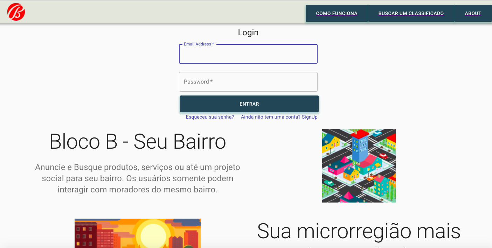

# BLOCO B
> BlocoB is an express rest api social media for your neighbors only

# Deployed at: 
[https://github.com/volneyvj/blocob-front](https://github.com/volneyvj/blocob-front)

## Features

- Add classifieds (product, service or social project)
- Communicate with other users from your neighborhood
- Make your neighborhood better!

This Api was created as part of IRONHACK`s WebDev bootcamp final project. Class of Oct/20.
Created by [Volney Faustini]



## Installation

```sh
make install
npm start
```

[![NPM Version][ "version": "0.1.0",]
[![Node Version][ "version": "12.16.0",]

## Usage example

Signup and Login necessary to utilize the app. A real zipcode must be informed at registration.
You can add as many classifieds you want. Classified and Profile Edit is also possible. Be aware that you cannot change the zipcode constatly. After first change you`ll need to waint 30 days to change address. 
You can visualize and interact with others user and classifieds, only from your neighborhood. 

## Meta

Volney Koudsi Faustini – [@Linkedin](https://www.linkedin.com/in/volney-koudsi-faustini/) – volney.faustini@gmail.com

API Server GitHub link:
[https://github.com/volneyvj/blocob-api](https://github.com/volneyvj/blocob-api)

## Contributing

1. Fork it (<https://github.com/volneyvj/blocob-front/fork>)
2. Create your feature branch (`git checkout -b feature/fooBar`)
3. Commit your changes (`git commit -am 'Add some fooBar'`)
4. Push to the branch (`git push origin feature/fooBar`)
5. Create a new Pull Request

<!-- Markdown link & img dfn's -->
[heroku]: https://blocob.herokuapp.com/